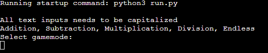

# Math Game

This is a simple math game played in a terminal for you to test your math skills

## How to play / Features

### Starting Screen

* You start by selecting one of the gamemodes shown

### Difficulty Screen

* After selecting a gamemode you have to pick the difficulty
