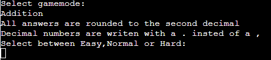
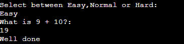
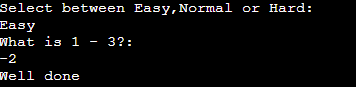
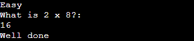
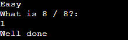
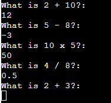
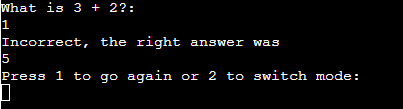

# Math Game

This is a simple math game played in a terminal for you to test your math skills

## How to play / Features

### Starting Screen

* You start by selecting one of the gamemodes shown

### Difficulty Screen

* After selecting a gamemode you have to pick the difficulty

* At which point the game starts

### Preview of the gamemodes on easy mode

### Over screen

* Once you have put in your answer you will be given two options
* One to do the same gamemode and difficulty again 
* and one to go back to the start screen to pick something new

