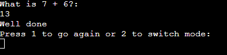

# Math Game

This is a simple math game played in a terminal for you to test your math skills

## How to play / Features

### Starting Screen

* You start by selecting one of the gamemodes shown

### Difficulty Screen

* After selecting a gamemode you have to pick the difficulty

* At which point the game starts

### Preview of the gamemodes on easy mode

### Over screen

* Once you have put in your answer you will be given two options
* One to do the same gamemode and difficulty again 
* and one to go back to the start screen to pick something new
* Endless mode only ends once you get something wrong

### Future Features

* New gamemode that allowes players to set their own parameters
* Adding a score counter to endless mode

## Testing

* All the values are correct and respond the way they are expected to do
* Passed PEP8 testing without issues
* Tested in two local terminals and in Heroku

### Bugs
* No unfixed bugs

## Deploment

* Cloned Python template in github
* Cloned that repository onto Visual studio where the code was written
* Pushed that onto github again
* Went on to Heroku and created a new app
* Linked Github and Heroku accounts
* Picked the repository from the create app section
* Pressed deploy

## Credits

* Code Insitute python template
